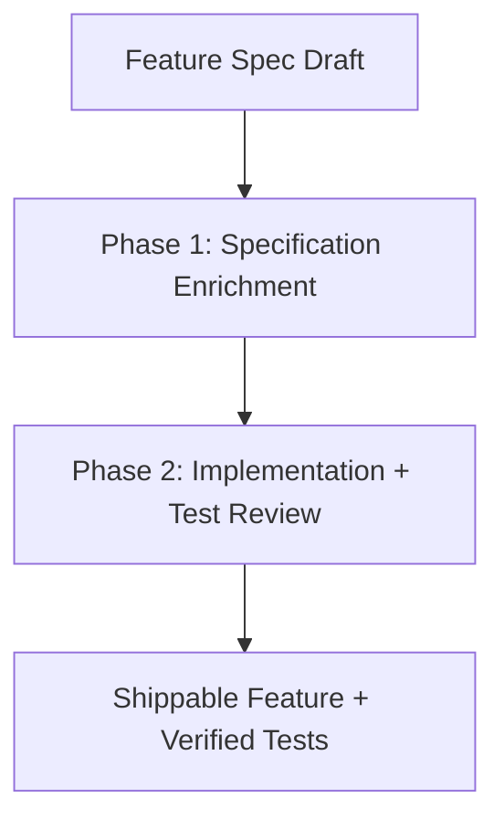
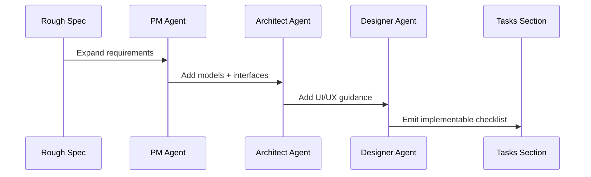
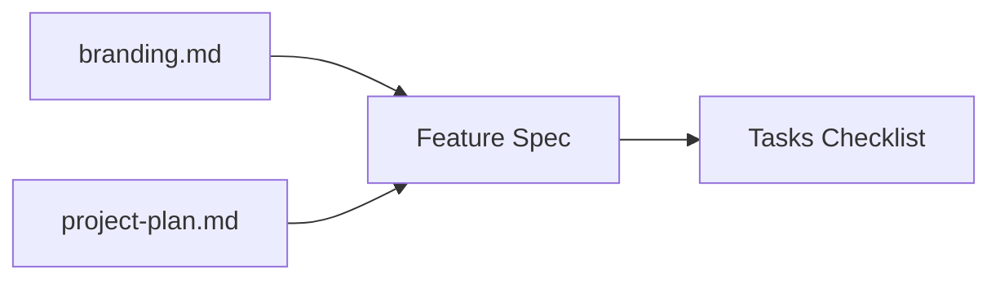
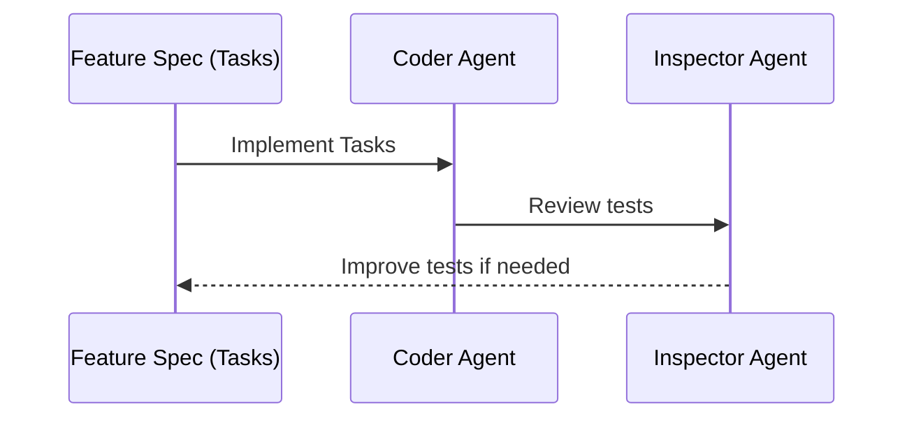

# Agentic Development Process

This repository uses an agent-driven workflow to evolve feature specifications and implement code in a controlled sequence.



## Overview
The workflow is split into two phases:
1. **Specification Enrichment**: A rough feature spec is expanded into a full spec with actionable tasks.
2. **Implementation + Test Review**: Tasks are implemented, then tests are reviewed for quality and coverage.

## Phase 1: Specification Enrichment
Run the feature enrichment script:

```bash
scripts/feat.sh <feature-spec-file>
```



Sequence:
- **PM Agent** expands requirements, acceptance criteria, telemetry, and compliance notes.
- **Architect Agent** defines data models, interfaces, and package layout constraints.
- **Designer Agent** adds UI/UX guidance aligned to branding and accessibility.

Outcome:
- The feature spec contains a **"## Tasks"** section with a checklist of implementable tasks.
- The spec is now ready for implementation review.

## Design + Plan Influence
Feature specs must align with:
- `specs/design/branding.md` for visual identity, typography, tone, and UI conventions.
- `specs/design/project-plan.md` for sequencing, dependencies, and milestone alignment.



During Phase 1:
- PM/Architect/Designer should explicitly incorporate these design and plan constraints into the spec.
- Tasks should reflect any required design language or plan ordering to prevent rework.

## Phase 2: Implementation + Test Review
After reviewing the spec, run the implementation script:

```bash
scripts/impl.sh <feature-spec-file>
```



Sequence:
- **Coder Agent** implements the tasks listed under **"## Tasks"** using the full feature spec as context.
- **Inspector Agent** reviews unit and BDD tests for industry best practices and coverage.

Outcome:
- Feature tasks are implemented.
- Tests are validated and improved if needed.

## Notes
- Agents must maintain NIST 800-53 Rev 5 compliance at all times.
- The **Tasks** section is the single source of truth for implementation work.
- The Inspector agent focuses on test quality and determinism; changes are only made when needed to fix test reliability.
